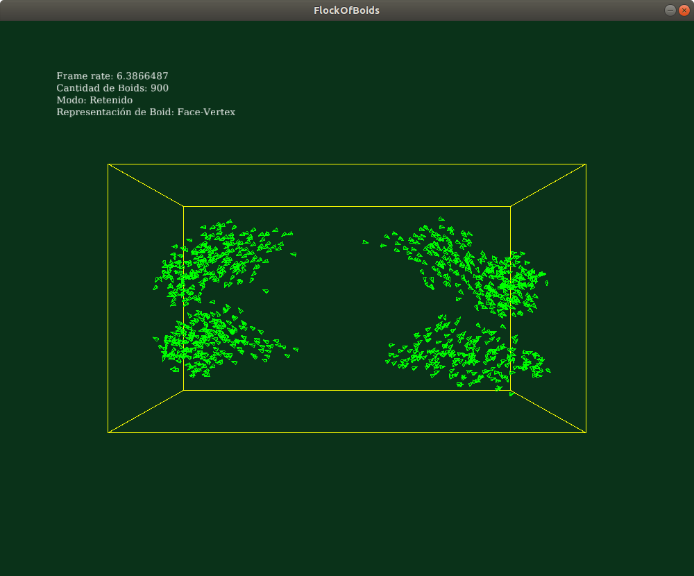
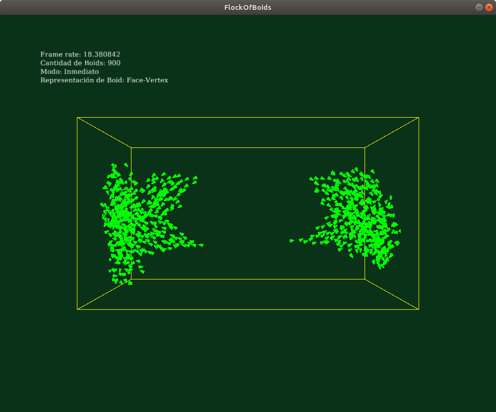
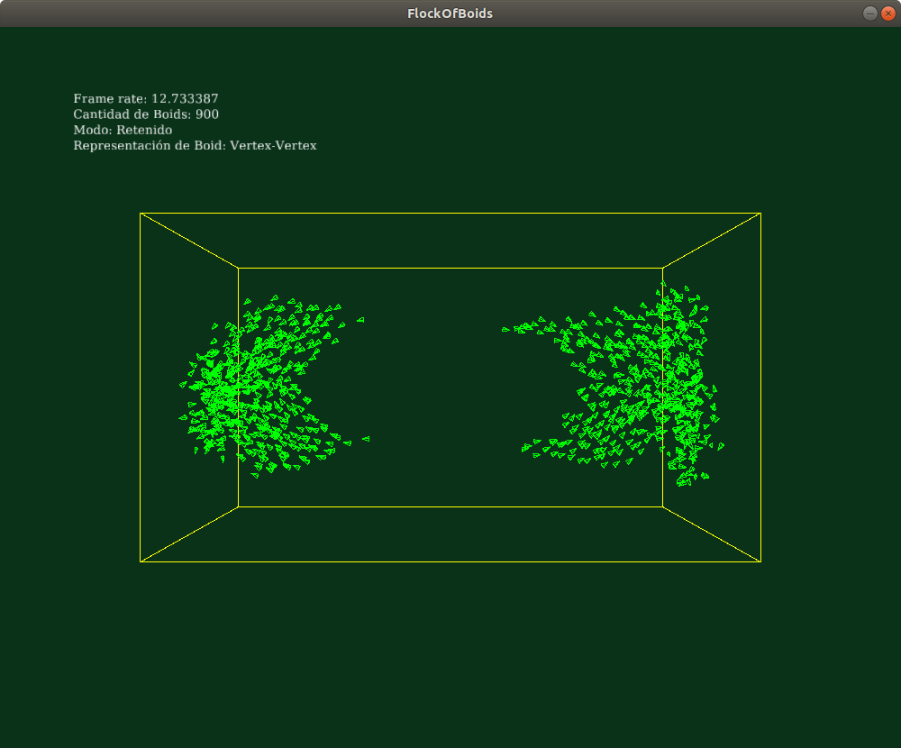
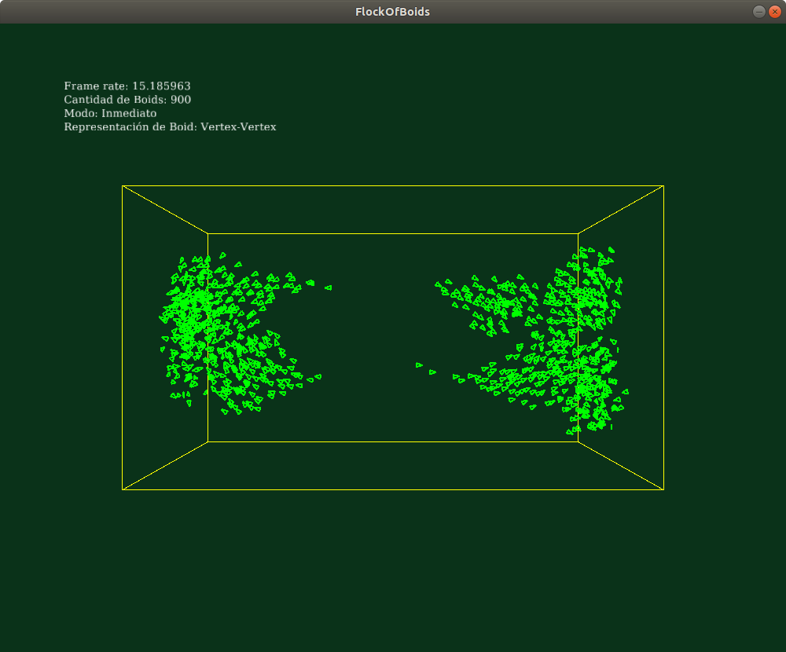
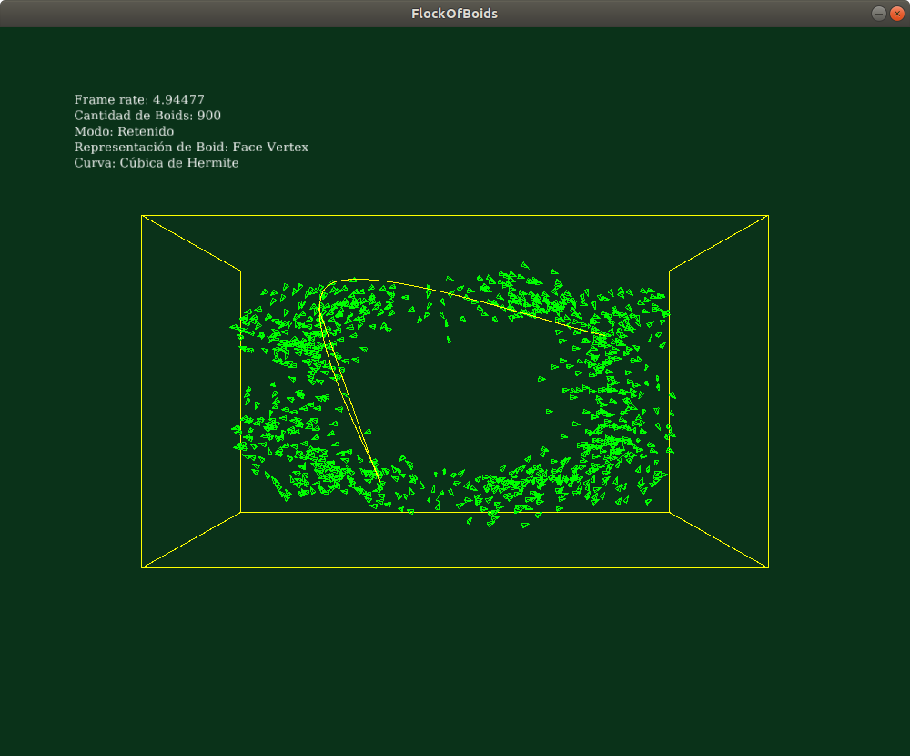
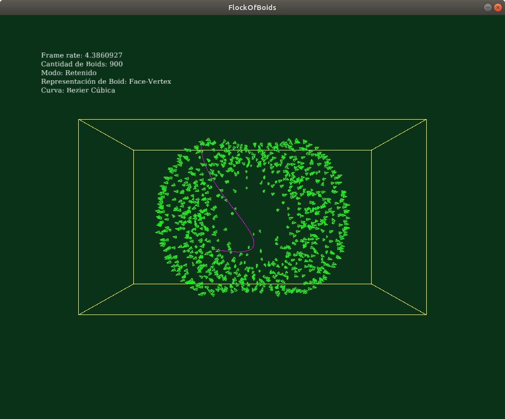
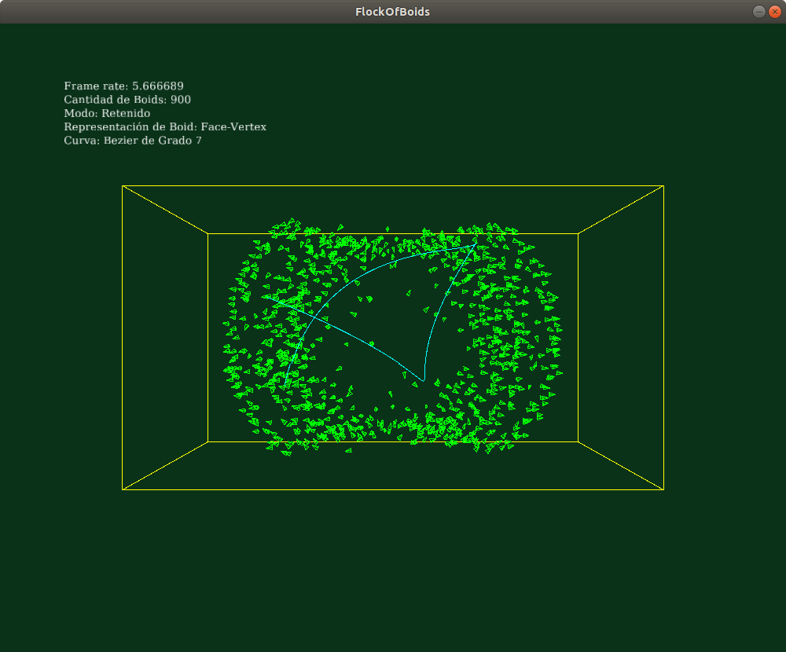

# Taller de representación

## Propósitos

1. Estudiar la relación entre las [aplicaciones de mallas poligonales](https://github.com/VisualComputing/representation), su modo de [representación](https://en.wikipedia.org/wiki/Polygon_mesh) (i.e., estructuras de datos empleadas para representar la malla en RAM) y su modo de [renderizado](https://processing.org/tutorials/pshape/) (i.e., modo de transferencia de la geometría a la GPU).
2. Estudiar algunos tipos de [curvas y superficies paramétricas](https://github.com/VisualComputing/Curves) y sus propiedades.

## Tareas

Empleando el [FlockOfBoids](https://github.com/VisualComputing/frames/tree/master/examples/demos/FlockOfBoids):

1. Represente la malla del [boid](https://github.com/VisualComputing/frames/blob/master/examples/demos/FlockOfBoids/Boid.pde) al menos de dos formas distintas.
2. Renderice el _flock_ en modo inmediato y retenido, implementando la función ```render()``` del [boid](https://github.com/VisualComputing/frames/blob/master/examples/demos/FlockOfBoids/Boid.pde).
3. Implemente las curvas cúbicas de Hermite y Bezier (cúbica y de grado 7), empleando la posición del `frame` del _boid_ como punto de control.

## Opcionales

1. Represente los _boids_ mediante superficies de spline.
2. Implemente las curvas cúbicas naturales.

## Integrantes

Uno, o máximo dos si van a realizar al menos un opcional.

Complete la tabla:

|   Integrante   | github nick |
|----------------|-------------|
| Camilo Pinilla | capinillab  |

## Discusión

### Representación

Los Boid se representaron usando las tecnicas _Face-Vertex_ y _Vertex-Vertex_, para simplificar la legibilidad del código en Processing estos se implementaron en clases aparte.

Las mallas _Face-Vertex_ representan un objeto como un conjunto de caras y un conjunto de vértices [Referencia](https://en.wikipedia.org/wiki/Polygon_mesh#Face-vertex_meshes)

Las mallas _Vertex-Vertex_ representan un objeto como un conjunto de vértices conectados a otros vértices [Referencia](https://en.wikipedia.org/wiki/Polygon_mesh#Vertex-vertex_meshes)


El renderizado en modo _Inmediato_ es el uso por defecto de processing, por lo tanto para este no se realizo nada en particular. El modo _Retenido_ requirio usar _PShapes_ para guardar los objetos a renderizar, de este modo el rendimiendo es inferior obteniendo un menor frame rate, debido a que requieren mas calculos por fotograma.

##### Resultados obtenidos de la combinación de los diferentes modos y formas de representación

Modo: Retenido.
Representación de Boid: Face-Vertex.


Modo: Inmediato.
Representación de Boid: Face-Vertex.


Modo: Retenido.
Representación de Boid: Vertex-Vertex.


Modo: Inmediato.
Representación de Boid: Vertex-Vertex.



### Curvas

Para la implementación de las diferentes curvas, se utilizaron los métodos encontrados para [Hermite](https://en.wikipedia.org/wiki/Cubic_Hermite_spline) y [Bezier](https://en.wikipedia.org/wiki/B%C3%A9zier_curve), para estas se tomas aleatoriamente _boids_ como puntos de control, 4 para el caso de Hermite y Bezier Cúbica y 8 para el caso de Bezier de Grado 7, esto se puede cambiar en tiempo de ejecución con la tecla "c" .

##### Resultados obtenidos de la representación de las diferentes curvas

Curva: Cúbica de Hermite.


Curva: Bezier Cúbica.


Curva: Bezier de Grado 7.



### Funcionamiento

Debido a que el cambio de _Modo_ y _Tipo de Renderizado_ se realiza en la función _setup()_ de _FlockOfBoids_ estos no se pueden cambiar en tiempo de ejecución, para probar los diferentes modos se debe cambiar las variables de _FlockOfBoids_ ubicadas en las lineas 40 y 41.

```
boolean modo = true; // true Retained, false Inmediate
boolean representation = true; // true Face-Vertex, false Vertex-Vertex
```
Lista de funciones de teclas de _FlockOfBoids_.

| Tecla | Efecto |
|:-----:|--------|
|  ' '  | Cambia entre modos de vista. |
|  'a'  | Inicia/Detiene Animación. |
|  'p'  | Imprime Frame Rate actual (consola) |
|  'm'  | Cambia modo visual de Boid |
|  'v'  | Activar/Descativar rebote en pared de Boid |
|  'c'  | Cambia el tipo de curva |

## Entrega

* Subir el código al repositorio de la materia antes del 3/2/19 a las 24h.
* Presentar el trabajo en la clase del 6/2/19 o 7/2/19.
